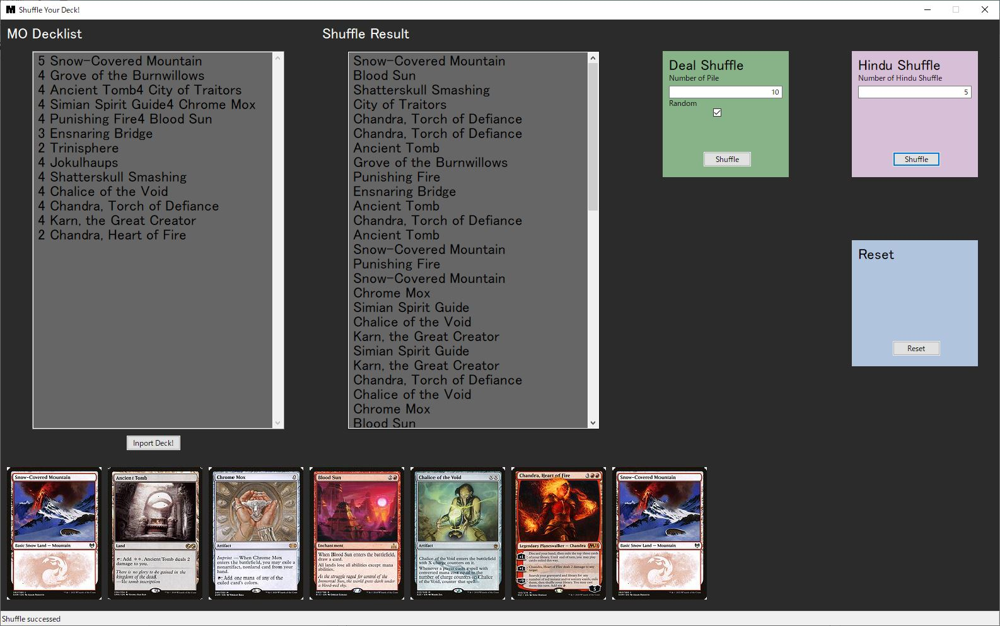

# Shuffle Your Deck!
As shown in the figure, this software displays the shuffled deck list and initial hand by inputting the MO deck list, selecting the shuffle to be performed, and pressing the button.

Currently, only Hindu shuffle and deal shuffle are supported, but other shuffle methods will be supported in the future.

## What is needed to running this code?
This code is executed using the following external packages. Please install them in your own execution environment if necessary.
- wxPython 4.2.1
- [scrython 1.11.0](https://github.com/NandaScott/Scrython)

## Cautions on Use
This software uses the [API](https://scryfall.com/docs/api) provided by [Scryfall](https://scryfall.com/) to retrieve card images, and  although no clear value for RateLimit is provided, it is estimated to be around 10 requests/s.  Please avoid excessive shuffling, such as hitting the shuffle button repeatedly. I plan to fix this problem soon by retaining the card information once acquired until the software is terminated.

## Disclamer
We are not responsible for any information or services provided by this software. We are not responsible for any damages caused by the contents provided in this software.  
This software is unofficial fan content in accordance with the Fan Content Policy. It is not authorized/permitted by Wizards of the Coast, Inc. Some of the subject matter contains property of Wizards of the Coast LLC. ©Wizards of the Coast LLC